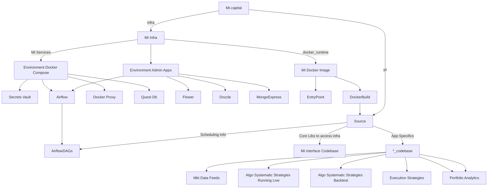

# MI.Capital - Intellectual Capital Automation

## Dependencies and Setup

### Python Version Requirements

- Core functionality: Python 3.13
- AI components: Python 3.9-3.12 (temporary requirement until AI packages add Python 3.13 support)

### Package Management

This project uses Poetry for dependency management. To get started:

1. Install Poetry:

```bash
curl -sSL https://install.python-poetry.org | python3 -
```

2. Install core dependencies:

```bash
poetry install --without ai
```

3. For AI components (requires Python 3.9-3.12):

```bash
poetry install --with ai
```

## System Overview



## Goal

`Outcome: send myself a quote everyday @ 7am.`

## Research to do this in cloud

How to run an airflow instance as a hobbyist:
MWAA = 4k
Azzure 0.49 per hour. = 4k
pythonanywhere - low cpu time.

So go local, put up with downtime..... always on local host.
https://marclamberti.com/blog/airflow-on-kubernetes-get-started-in-10-mins/

## Background Learning / Refresh

- Brew
- Docker: https://www.youtube.com/watch?v=pg19Z8LL06w
- Docker-compose: https://www.youtube.com/watch?v=SXwC9fSwct8
- airflow:
- mongo:

## Setup Machine with required Items

### Base machine requirements

- https://brew.sh/

  -

- brew install python

  - brew link --overwrite python
  - export PATH="/usr/local/opt/python/libexec/bin:$PATH"
  - brew install python@3.12 (or older version per the poetry file)

- brew install git

  - git config --global user.name "Dave Dawson"
  - git config --global user.email davedawson.co@gmail.com
  - git config --global core.editor "nano"

- brew install --cask visual-studio-code

# ==> Next steps - modified to add Homebrew + Python to PATH

- Run these commands in your terminal to add Homebrew to your PATH:
  echo >> /Users/daviddawson/.zprofile
  echo "# Homebrew: " >> /Users/daviddawson/.zprofile
  echo 'eval "$(/opt/homebrew/bin/brew shellenv)"' >> /Users/daviddawson/.zprofile
    echo >> /Users/daviddawson/.zprofile
    echo "# Homebrew : Python" >> /Users/daviddawson/.zprofile
    echo 'export PATH="/opt/homebrew/opt/python/libexec/bin:$PATH"' >> /Users/daviddawson/.zprofile
  eval "$(/opt/homebrew/bin/brew shellenv)"
- Run brew help to get started
- Further documentation:
  https://docs.brew.sh

#### Pre-requisites:

- docker -> website dmg

### Python Virtual Envs:

- https://csguide.cs.princeton.edu/software/virtualenv#:~:text=A%20Python%20virtual%20environment%20(venv,installed%20in%20the%20specific%20venv.
- source dwdrun_1.0.0/bin/activate
- deactivate

## AIRFLOW UI:

To Restart UI Run this command:

> http://localhost:8080/

## Enable airflow to run from git

To enable airlfow jobs to be automatially updated from github repo one must connect the two via github shared Key.

1. ssh-keygen -t ed25519 -C "davewd@me.com"
2. Specify new location w name
3. cat ~/.ssh/id_ed25519_blah.pub
4. Copy pub key to github (https://github.com/davewd/airflow/settings/keys)
5.

## To create the Docker image that will run within each airflow task

1. cd dwdrun_infra/docker_runtime
2. chmod +x ./build_infra.sh
3. ./build_infra.sh
4. test\_ ....

## Run the docker compose

1. cd dwdrun_infra/
2. chmod +x ./start_all_services.sh
3. ./start_all_services.sh

## ToDo

1. Send Airflow Calendar view by email each evening

## Quest Db Setup

1. brew install questdb
2. mkdir cryptofeed-questdb
3. cd cryptofeed-questdb
4.

## Update Poetry Python Version

1. `poetry env use python` (or python 3.13.2) it will work out version from the binary
2. Update the pyproject.toml file [remember 3.13 < 3.13.2 !]
3. `poetry lock`
4. `poetry install`
5. update Dockerfile base image -> 3.13.X
6. build docker image > build_docker.sh
7. test docker image >tests/test_run_micap.sh
